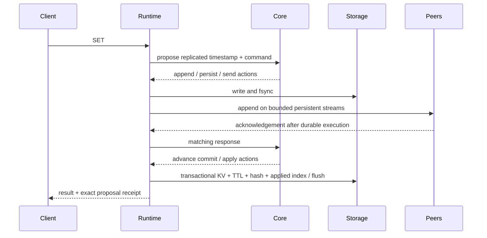

# Architecture and durability contract

## Pure consensus boundary

`raft-core` contains deterministic timers, seeded randomness, protocol transitions, a Raft log abstraction, configuration state and replication progress. It has no disk/network/async/wall-clock access. Ticks and messages emit explicit actions. Browser code lives under `ui/dashboard/` and observes typed HTTP/SSE contracts. The lab runs in a separate executable with a simulator, not the live runtime.

## Serialized action execution

A single runtime gate covers every core step and its complete durable action list, including gRPC request processing. The same executor returns synchronous peer responses and publishes events. It never awaits under that gate. Storage failure fences the runtime, cancels client waiters and prevents acknowledgements; restart must reconcile durable state. Synchronous fsync costs can delay other requests and heartbeat processing; conservative durability is intentional and measured by benchmarks.

Proposal/read/inbound queues are 4096/8192/16384. Pending client waiters have five-second deadlines. Outbound work and persistent peer queues are bounded; shedding/retry replaces unbounded memory growth. Periodic heartbeats reset stale data-replication windows after lost acknowledgements. HTTP/RESP connection limits are 512; snapshot receive size is bounded to 256 MiB. Normal proposals are bounded to 1 MiB and AppendEntries batches to approximately 2 MiB.

## Commit and linearizable reads

A stable voter set commits the index supported by `n/2+1` voters; absent peer progress contributes zero. Joint consensus requires both old and new majorities. Only current-term entries advance commit directly. ReadIndex requires a committed current-term entry, a uniquely correlated request round and same-term voter acknowledgements satisfying the current configuration. Runtime reads execute only after durable state-machine application reaches that confirmed index. Demotion/timeout cancels pending rounds. No follower read fallback exists.

The read context retry map retains up to 16 request IDs per peer/round. Very slow or overloaded peers can therefore cause availability failures; they do not authorize stale successful reads. Readiness is based on recent current-term leader/quorum contact, not merely process liveness.

## Atomic state machine and replicated time

Each log command transaction updates KV, ordered expiry index, per-key expiry index, rolling history hash and applied index together, followed by a durable sled flush. Noop/configuration entries advance the apply pointer without applying a command. Replayed indices are ignored; index gaps fail. INCR rejects invalid numbers and overflow.

Leader timestamps are monotonic and embedded in replicated commands; a one-second replicated Tick expires idle keys. State mutations expire keys at the command's logical time before applying. Reads do not compare follower wall clocks. SET/MSET clear old TTLs; EXPIRE replaces them; PERSIST removes them; TTL/PTTL derive remaining time from committed logical time. A legacy per-key migration keeps the latest expiry for each key.

The exposed state hash is a rolling command-history hash, not a standalone cryptographic digest of sorted key/value contents. Snapshot integrity uses separate SHA-256 checksums.

## Checkpoints, install and recovery

A checkpoint packages format version, included index/term, the configuration at that applied index, logical time, history hash, KV entries and TTL metadata. The logical state has its own checksum; the published file checksum also covers serialized membership metadata. Temporary data/metadata/checksum files are fsynced, then published with the data rename last and parent-directory fsync. A published identity cannot be replaced with different contents through independent renames. Unpublished temporary files are ignored. Retention keeps three published checkpoints.

Snapshot transfer uses 64 KiB streamed chunks, offsets, metadata consistency, CRC32C and an explicit final marker. A receiver spools to a temporary file and syncs it, then assembles the bounded package for the pure core. Installation validates the complete state/configuration, writes the checkpoint, restores/flushes state, advances durable pointers and hard state, repairs/compacts the local log, and only then acknowledges. The durable checkpoint allows recovery across intermediate install steps.

Startup verifies the snapshot checksum and reconciles `snapshot <= applied <= commit <= last_log`, including snapshot boundaries. The volatile apply pointer starts from the durable state-machine index, not the snapshot boundary. Committed unapplied entries replay before serving traffic. Torn log tails recover a valid CRC-checked prefix; noncontiguous records and unavailable committed history fail startup. Corrupt pointer lengths fail cleanly.

## Membership and transport

Replicated member metadata carries peer, RESP and HTTP endpoints plus optional certificate fingerprints. Learners replicate without voting; promotion requires catch-up. Voting changes use joint consensus and final configuration entries. Runtime peer clients follow configuration changes; removed peers are pruned and not reintroduced from stale startup TOML. Membership operations are serialized per runtime.

Normal traffic uses persistent bidirectional Envelope streams with bounded queues and reconnect; unary fallback remains. Snapshot traffic uses its dedicated stream. mTLS verifies cluster trust and binds a sender's claimed node ID to its registered DER-certificate fingerprint. This is a non-Byzantine Raft design; arbitrary dishonest behavior by trusted voting members is not tolerated.

## Diagnostics, events and observability

Typed node/peer diagnostics expose actual role/term/indices, addresses, state hash, recent log metadata, replication progress, disk usage and configuration. Raw commands/values are excluded. Failed remote observations return null indices and unavailable state. SSE keeps a 10,000-event ring and 2048-event broadcast capacity, resumes by Last-Event-ID, and emits a gap event on lag. The frontend deduplicates and keeps 250 visible events.

Prometheus owns runtime counters/gauges/histograms for roles/indices/elections/requests/errors/messages/snapshots/log bytes/lag and actual file fsync/metadata flush durations. Dashboard rates derive successive observed counters; chart samples are bounded to 60. Histogram percentiles are bucket estimates. Detailed history belongs in Prometheus/Grafana.

## Verification model

The simulator persists modeled hard state/log/applied state/checkpoints separately from volatile nodes, supports replay and checks election safety, leader completeness, log matching, committed entry immutability, state-machine safety and index monotonicity every step. Storage faults model durable action cut points and complete-record prefixes, not real kernel/fsync failures. Real storage tests cover torn bytes and interrupted checkpoint publication. External TCP proxies partition/delay real peer streams without adding live fault controls to the server. Short completed-operation histories are checked exhaustively; uncertain outcomes are not claimed as verified histories.
