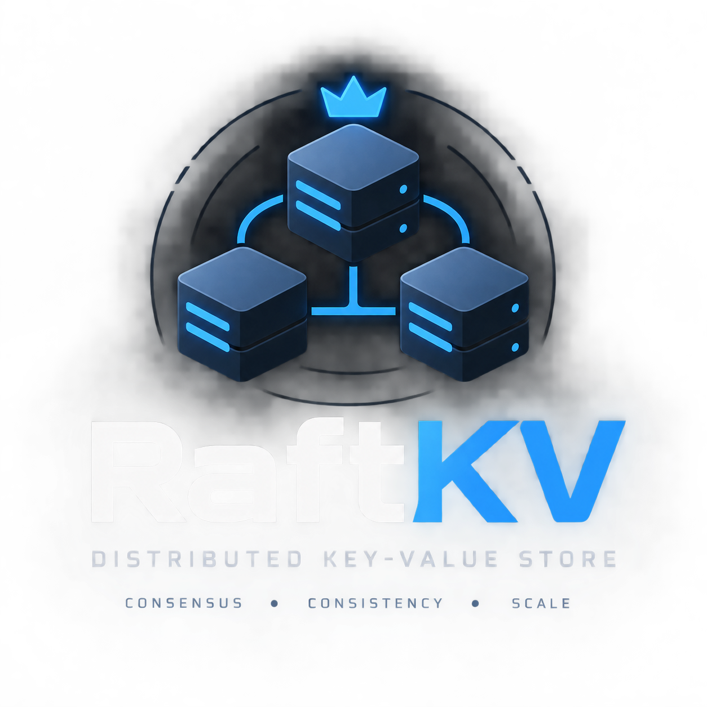
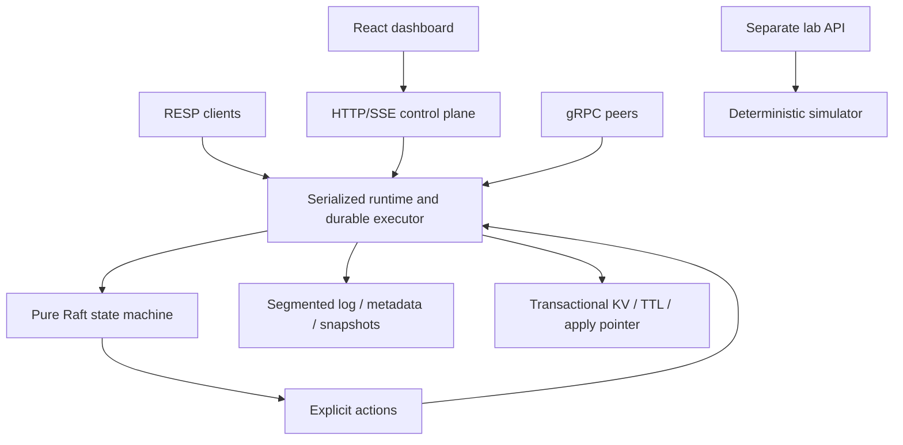

<p align="center"></p>

# RaftKV

A Raft-replicated key-value store in Rust, with a Redis-compatible RESP command subset, a React operator dashboard, and an isolated deterministic simulation lab.

**Status: experimental, unreleased.** Workspace version remains `0.1.0`; this change implements the proposed `0.2.0` development milestone. Local correctness, recovery, security and GUI checks are documented in [VERIFICATION.md](docs/VERIFICATION.md). They are evidence for the tested scenarios, not a proof of correctness or production readiness.

The complete supplied specification is preserved verbatim as [IMPLEMENTATION_PROMPT.md](IMPLEMENTATION_PROMPT.md). [IMPLEMENTATION_STATUS.md](docs/IMPLEMENTATION_STATUS.md) maps its workstreams to implementation and verification limits.

## Start a local cluster and dashboard

Requires Rust **1.94+**, Node.js **22.12+** (24 recommended), npm, and macOS/Linux. `protoc` is vendored.

```bash
git clone https://github.com/jeevanu345/raftkv.git
cd raftkv
./scripts/run_cluster.sh
# Another terminal, from the repository:
cargo run -p raftkv-server --bin raftkv-lab
# Another terminal:
cd ui/dashboard
npm ci
VITE_DEMO_MODE=false npm run dev
```

Open [the local dashboard](http://127.0.0.1:5173). Its seven routes are Overview, Key Explorer, Command Console, Raft Visualizer, Metrics, Simulation Lab, and Administration. Set `VITE_DEMO_MODE=true` for clearly labelled UI fixtures; live mode talks to real nodes and the separate lab process.

| Node | Peer gRPC | RESP | HTTP control | Metrics |
|---|---:|---:|---:|---:|
| 1 | 7001 | 6379 | 8080 | 9101 |
| 2 | 7002 | 6380 | 8081 | 9102 |
| 3 | 7003 | 6381 | 8082 | 9103 |

Local scripts use `.runtime/` for new data, logs and scoped PID files. Previously preserved `.run/` files are not used. Stop with `./scripts/stop_cluster.sh`. See [HOW_TO_RUN.md](HOW_TO_RUN.md) for configuration, TLS, authentication, backups and deployment.

## Implemented behavior

- Pure deterministic `raft-core`, majority and joint-consensus quorum calculation, correlated ReadIndex quorum confirmation, leadership transfer and replay-safe recovery.
- Atomic KV/TTL/applied-index/hash transactions; replicated monotonic logical time; automatic expiration; TTL/PTTL and bounded SCAN.
- Real logical state/configuration checkpoints; SHA-256 integrity; streamed CRC-checked snapshot chunks; durable install before acknowledgement; automatic compaction and retention.
- One serialized durable action executor shared by the runtime and gRPC paths; bounded queues and waiter deadlines; storage failures fence the node.
- Persistent bidirectional peer streams, dynamic learner registration, catch-up checks, promotion and joint removal.
- Typed JSON node diagnostics without command payloads, bounded SSE replay, Prometheus metrics including actual storage fsync/flush timing, and trustworthy unavailable-state rendering.
- Optional peer mTLS with node certificate identity binding, RESP TLS/AUTH/prefix ACLs, HTTPS admin tokens/RBAC, origin checks, secure session cookies and correlated durable audit records.
- Checksummed portable backups; inspected offline restore into an empty directory with explicit single-voter bootstrap semantics.
- Deterministic fault simulation and replay; external real-process TCP-proxy chaos tests; bounded-history linearizability checks; seven fuzz targets; Criterion and cluster benchmark matrices.
- Hardened Helm templates, NetworkPolicy, probes, resource limits, PVC retention, TLS/token secret mounting, ServiceMonitor/Grafana options and GitHub Actions checks.

## Architecture



Read [ARCHITECTURE.md](ARCHITECTURE.md), [API.md](docs/API.md), [SECURITY.md](docs/SECURITY.md), and [benchmark evidence](docs/BENCHMARKS.md).

## Verification

```bash
cargo fmt --all -- --check
cargo clippy --workspace --all-targets --locked -- -D clippy::correctness -D clippy::suspicious
RAFTKV_SIM_SEEDS=1000 cargo test --workspace --locked
cargo build --workspace --locked
python3 scripts/integration_cluster.py
python3 scripts/integration_cluster.py --nodes 5 --peer-tls
python3 scripts/chaos_cluster.py
python3 scripts/chaos_cluster.py --nodes 5
python3 scripts/integration_membership.py
python3 scripts/integration_security.py
python3 scripts/test_lab.py
cd ui/dashboard
npm ci
npm run typecheck && npm run build
npx playwright install chromium
npm test
RAFTKV_UI_TEST_MODE=live npm test
```

The `live` browser suite verifies API loading/error/empty/confirmation behavior using controlled responses. Real backend behavior is tested separately by the cluster scripts. Browser tests run headlessly from code.

## Limits

The RESP implementation is a supported subset, not complete Redis compatibility. SCAN is weakly consistent under concurrent writes, and non-`*` glob matching currently applies to UTF-8 key names. TTL progresses with replicated logical time and has approximately one-second idle expiration granularity. Snapshot install is chunked and spooled, but the pure core receives a bounded complete snapshot buffer (256 MiB maximum).

Fsync remains conservative and expensive; published short debug-build benchmark samples are not capacity planning data. Local fuzz smoke runs were not sanitizer/coverage instrumented; the nightly CI job supplies instrumentation. Docker image build, actual Kubernetes scheduling, Miri and long-running fuzz/soak jobs have not been verified locally. External Jepsen/Knossos/Porcupine execution requires a separately configured harness. Legacy empty snapshot files fail validation rather than being treated as valid state checkpoints.

## Dashboard preview

This screenshot shows labelled **demo fixtures**, not a production cluster.


## License

Apache-2.0, as declared in the workspace metadata.
