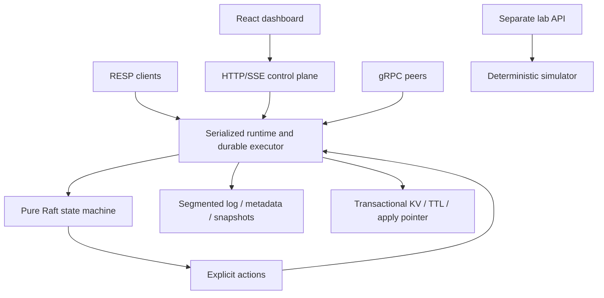
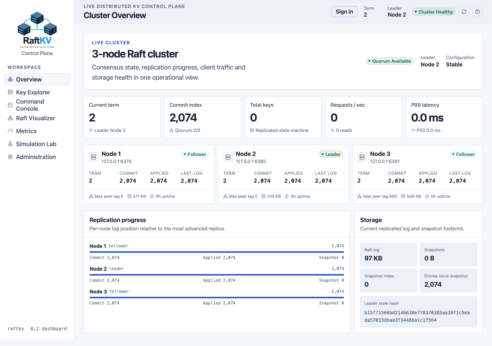
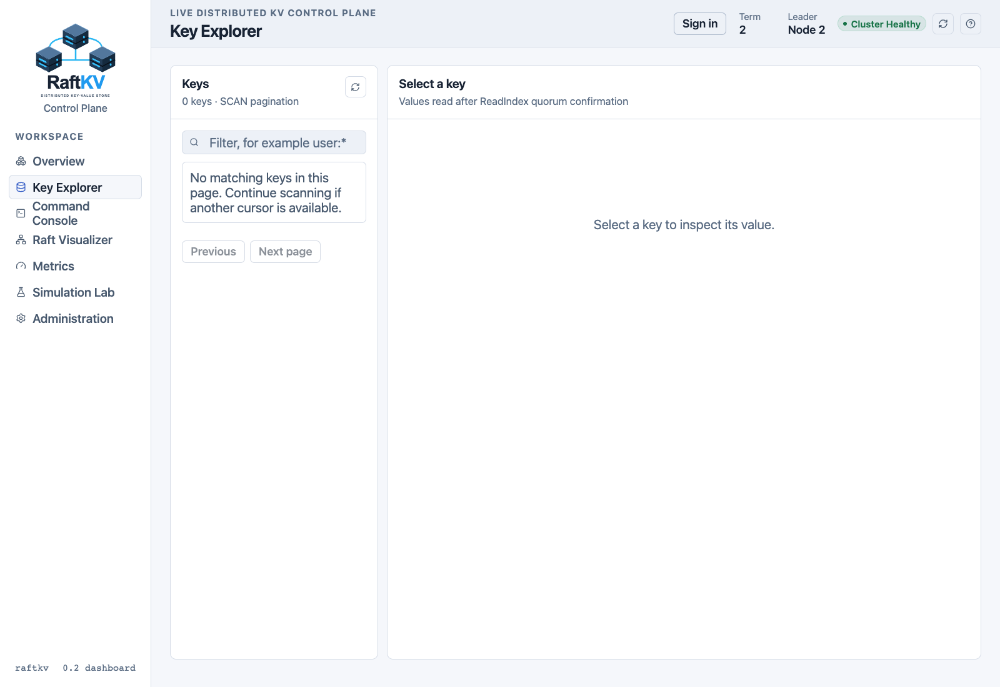
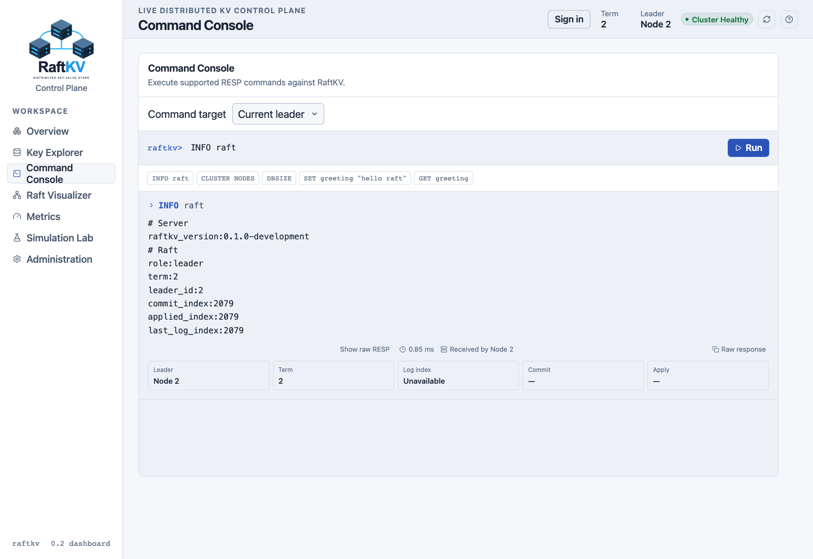
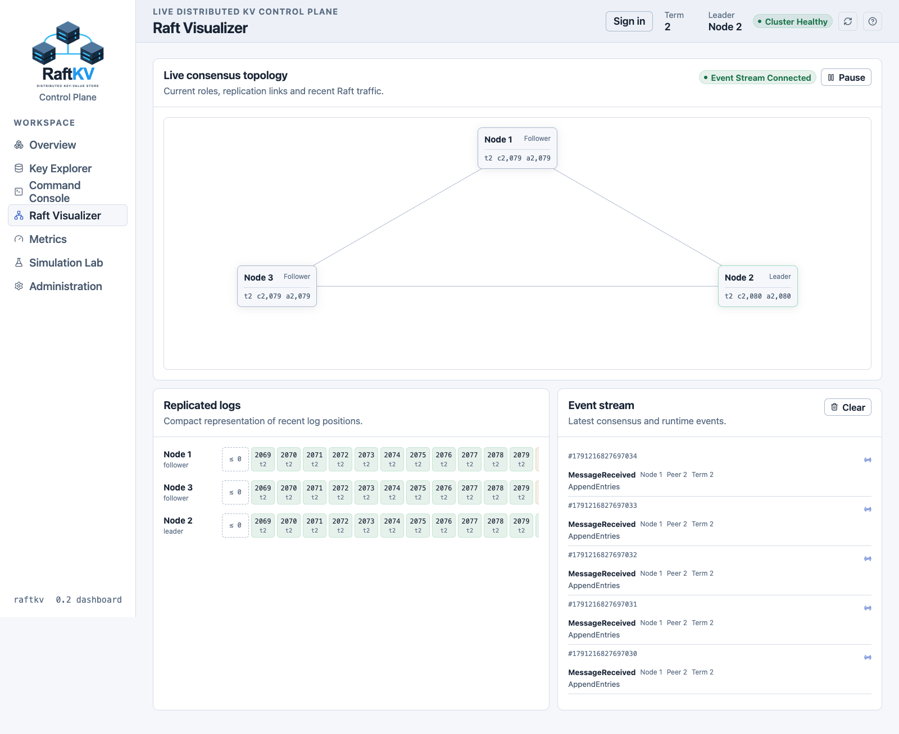
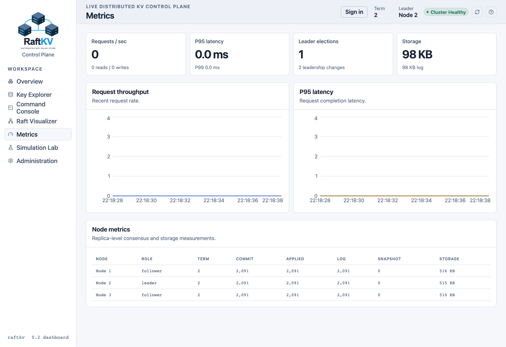
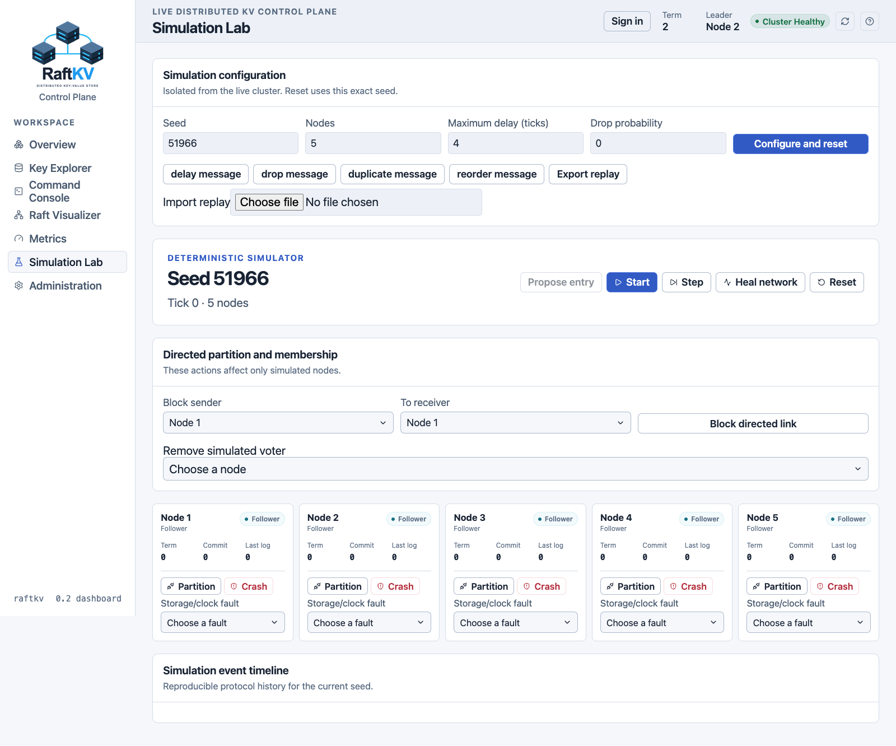
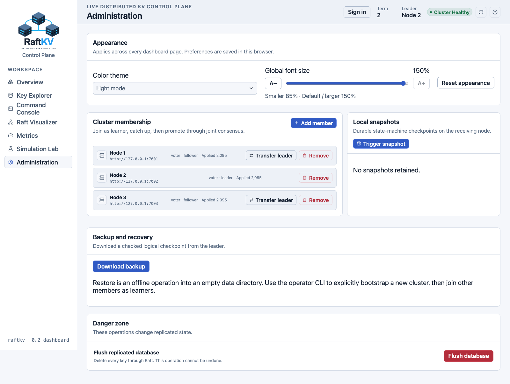

<p align="center">
  <picture>
    <source media="(prefers-color-scheme: dark)" srcset="ui/dashboard/public/raftkv-logo-dark.svg" />
    <source media="(prefers-color-scheme: light)" srcset="ui/dashboard/public/raftkv-logo-light.svg" />
    
  </picture>
</p>

# RaftKV

RaftKV is a distributed key-value store written in Rust. A group of server processes elects a leader, replicates commands through a Raft log, commits them after quorum agreement, and applies them to durable storage. Reads use ReadIndex quorum confirmation before returning state. Clients can use a supported Redis-compatible RESP command subset or the HTTP control plane.

The React/TypeScript dashboard makes this state visible: inspect node roles and replication progress, browse keys, execute commands, watch consensus events, and manage membership and snapshots. A separate deterministic Simulation Lab lets you explore network partitions, crashes and storage faults without wiring those fault controls to the live cluster.

**Status: experimental, unreleased.** Workspace version remains `0.1.0`; this change implements the proposed `0.2.0` development milestone. Local correctness, recovery, security and GUI checks are documented in [VERIFICATION.md](docs/VERIFICATION.md). They are evidence for the tested scenarios, not a proof of correctness or production readiness.

The complete supplied specification is preserved verbatim as [IMPLEMENTATION_PROMPT.md](IMPLEMENTATION_PROMPT.md). [IMPLEMENTATION_STATUS.md](docs/IMPLEMENTATION_STATUS.md) maps its workstreams to implementation and verification limits.

## Start a local cluster and dashboard

Requires Rust **1.94+**, Node.js **22.12+** (24 recommended), npm, and macOS/Linux. `protoc` is vendored.

```bash
git clone https://github.com/jeevanu345/raftkv.git
cd raftkv
./scripts/run_cluster.sh
# Another terminal, from the repository:
cargo run -p raftkv-server --bin raftkv-lab
# Another terminal:
cd ui/dashboard
npm ci
VITE_DEMO_MODE=false npm run dev
```

Open [the local dashboard](http://127.0.0.1:5173). Its seven routes are Overview, Key Explorer, Command Console, Raft Visualizer, Metrics, Simulation Lab, and Administration. Set `VITE_DEMO_MODE=true` for clearly labelled UI fixtures; live mode talks to real nodes and the separate lab process.

| Node | Peer gRPC | RESP | HTTP control | Metrics |
|---|---:|---:|---:|---:|
| 1 | 7001 | 6379 | 8080 | 9101 |
| 2 | 7002 | 6380 | 8081 | 9102 |
| 3 | 7003 | 6381 | 8082 | 9103 |

Local scripts use `.runtime/` for new data, logs and scoped PID files. Previously preserved `.run/` files are not used. Stop with `./scripts/stop_cluster.sh`. See [HOW_TO_RUN.md](HOW_TO_RUN.md) for configuration, TLS, authentication, backups and deployment.

## Implemented behavior

- Pure deterministic `raft-core`, majority and joint-consensus quorum calculation, correlated ReadIndex quorum confirmation, leadership transfer and replay-safe recovery.
- Atomic KV/TTL/applied-index/hash transactions; replicated monotonic logical time; automatic expiration; TTL/PTTL and bounded SCAN.
- Real logical state/configuration checkpoints; SHA-256 integrity; streamed CRC-checked snapshot chunks; durable install before acknowledgement; automatic compaction and retention.
- One serialized durable action executor shared by the runtime and gRPC paths; bounded queues and waiter deadlines; storage failures fence the node.
- Persistent bidirectional peer streams, dynamic learner registration, catch-up checks, promotion and joint removal.
- Typed JSON node diagnostics without command payloads, bounded SSE replay, Prometheus metrics including actual storage fsync/flush timing, and trustworthy unavailable-state rendering.
- Optional peer mTLS with node certificate identity binding, RESP TLS/AUTH/prefix ACLs, HTTPS admin tokens/RBAC, origin checks, secure session cookies and correlated durable audit records.
- Checksummed portable backups; inspected offline restore into an empty directory with explicit single-voter bootstrap semantics.
- Deterministic fault simulation and replay; external real-process TCP-proxy chaos tests; bounded-history linearizability checks; seven fuzz targets; Criterion and cluster benchmark matrices.
- Hardened Helm templates, NetworkPolicy, probes, resource limits, PVC retention, TLS/token secret mounting, ServiceMonitor/Grafana options and GitHub Actions checks.

## Architecture



Read [ARCHITECTURE.md](ARCHITECTURE.md), [API.md](docs/API.md), [SECURITY.md](docs/SECURITY.md), and [benchmark evidence](docs/BENCHMARKS.md).

## Verification

```bash
cargo fmt --all -- --check
cargo clippy --workspace --all-targets --locked -- -D clippy::correctness -D clippy::suspicious
RAFTKV_SIM_SEEDS=1000 cargo test --workspace --locked
cargo build --workspace --locked
python3 scripts/integration_cluster.py
python3 scripts/integration_cluster.py --nodes 5 --peer-tls
python3 scripts/chaos_cluster.py
python3 scripts/chaos_cluster.py --nodes 5
python3 scripts/integration_membership.py
python3 scripts/integration_security.py
python3 scripts/test_lab.py
cd ui/dashboard
npm ci
npm run typecheck && npm run build
npx playwright install chromium
npm test
RAFTKV_UI_TEST_MODE=live npm test
```

The `live` browser suite verifies API loading/error/empty/confirmation behavior using controlled responses. Real backend behavior is tested separately by the cluster scripts. Browser tests run headlessly from code.

## Limits

The RESP implementation is a supported subset, not complete Redis compatibility. SCAN is weakly consistent under concurrent writes, and non-`*` glob matching currently applies to UTF-8 key names. TTL progresses with replicated logical time and has approximately one-second idle expiration granularity. Snapshot install is chunked and spooled, but the pure core receives a bounded complete snapshot buffer (256 MiB maximum).

Fsync remains conservative and expensive; published short debug-build benchmark samples are not capacity planning data. Local fuzz smoke runs were not sanitizer/coverage instrumented; the nightly CI job supplies instrumentation. Docker image build, actual Kubernetes scheduling, Miri and long-running fuzz/soak jobs have not been verified locally. External Jepsen/Knossos/Porcupine execution requires a separately configured harness. Legacy empty snapshot files fail validation rather than being treated as valid state checkpoints.

## Dashboard guide and screenshots

The dashboard now starts with **150% font size**. **Administration → Appearance** contains the only theme and text-size controls: choose light/dark mode, adjust text from 85% to 150%, or reset to dark mode at 150%. Preferences persist locally per browser and synchronize across its tabs. Existing preferences migrate to the new default while retaining the chosen theme. The transparent SVG brand has no background tile; its wordmark adapts to the theme. All dropdowns are custom themed, keyboard-accessible menus rather than operating-system selectors.

These screenshots were captured on **2026-10-05**, at **1600 × 1100** with **150% text**, from the actual local three-node cluster and separate lab service. The primary gallery below uses **light mode**. They are live application screenshots, not the previous demo fixtures. Term, leader, indexes and metrics reflect the capture moment and can differ between screens. The local database and snapshot list were empty; those screens intentionally show their real empty states. Metrics display a short observation window, not a performance benchmark.

### Cluster Overview

The starting point for operational inspection: current term and leader, stable/joint configuration, quorum health, key count, request/latency summaries, per-node commit/applied/log positions, replication progress, storage footprint and leader state hash. Node cards open detailed diagnostics. Missing or unreachable values remain explicitly unavailable.



### Key Explorer

Enumerates keys using bounded SCAN pagination rather than `KEYS *`. Select a key to inspect size, type, TTL and value, choose UTF-8/Base64/hexadecimal representation, edit the value and expiry, or confirm deletion. Changes are replicated through Raft; value reads wait for ReadIndex confirmation. The screenshot shows the genuine empty database state.



### Command Console

Runs supported RESP commands and displays the structured response, raw RESP, receiving node, leader term and timing. Writes additionally expose the actual proposal index and commit/apply receipt when available. Command history supports keyboard recall; FLUSHDB requires confirmation. “Current leader” forwards eligible requests, while an explicitly selected follower exposes its real MOVED response. The screenshot shows a successful `INFO raft` request to the running cluster.



### Raft Visualizer

Shows current node roles, peer communication, recent term/index log entries, commit/applied progress and snapshot boundaries. The SSE event timeline preserves complete event identifiers without overlapping icons or details. Pause the displayed stream, clear its local history, or inspect node diagnostics; animation represents observed events rather than generated protocol traffic.



### Metrics

Plots recent real request throughput and latency samples, together with storage and replication summaries. The frontend bounds its sample history and derives rates from counter deltas. Quiet workloads can legitimately produce flat or zero values. Prometheus/Grafana provide the separate monitoring path for longer-term history and alerts.



### Simulation Lab

Connects to the **separate `raftkv-lab` process**, not live-cluster administration. Its reproducible seed, tick counter and node state accompany start/pause/step, proposals, crashes/restarts, partitions, directed link blocking, storage/clock faults and simulated membership actions. Import/export supports deterministic replay. The captured lab is an isolated initial scenario; its nodes are not extra production members.



### Administration

Contains Appearance settings, cluster membership, learner promotion, leadership transfer, snapshot creation, backup download and confirmed destructive actions. **Add member registers a server; it does not launch a process.** Start a new node with unique ID, ports and data directory, register it as a learner, wait for catch-up, then promote it to voter. Offline restore uses the operator CLI and an empty directory; the UI explains that workflow instead of replacing live state.




### Reproduce the gallery

With the local cluster, lab and Vite dashboard running:

```bash
cd ui/dashboard
npm ci
npx playwright install chromium
cd ../..
node scripts/capture_dashboard.mjs
```

The script opens fresh headless browser contexts, asserts the 150% default on every screen, captures light mode, checks for page errors and horizontal overflow, and records [capture metadata](docs/screenshots/capture.json). It submits only the read-only `INFO raft` console command and does not seed keys or mutate membership. Set `CHROME_PATH` to use an installed Chrome executable, or `RAFTKV_DASHBOARD_URL` / `RAFTKV_SCREENSHOT_DIR` to change the service URL / destination.

## License

Apache-2.0, as declared in the workspace metadata.
